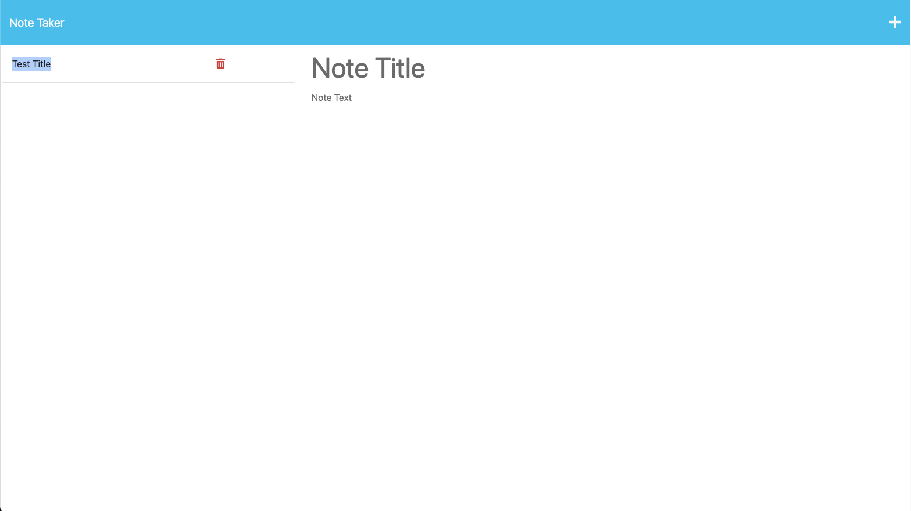

# NOTE TAKER 5000

## DESCRIPTION
The Note Taker is to made to take notes. It could add a subject and add details for the subject notes. It could be saved on database to keep the notes and have the functions to delete the notes if ytou dont no longer need it. 

## TABLE OF CONTENTS

- [Installation](#installation)
- [Usage](#usage)
- [License](#license)
- [Technologies Used](#technologies-used)
- [Images](#images-of-application)

## INSTALLATION

First need to clone the repo from (https://github.com/rlee7029/note-taker) and run 'npm i' in ther terminal

## USAGE

start the app by using 'npm i' and use the localhost 3001 to run the application. 

## Technologies Used

- Html
- CSS
- Bootstrap
- Javascript
- Node.js
  - Express.js

## Images of Application

